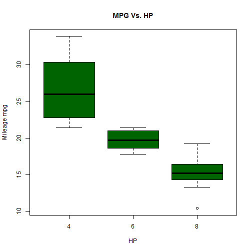

Developing Data Products - Project Presentation
========================================================
author: Leszek Diez
date: January 31, 2015

========================================================
## Summary
For the Developing Data Products Course Project, I have developed a Shiny Application for use with the mtcars data package in R.

## Application Purpose
My Shiny application allows the user to choose to explore the relationship between a chosen feature and the Mileage Per Gallon (MPG) variable.

The application allows the user to:
- Select the feature to compare with the MPG variable.
- Select the number of sample rows to show in the screen.


Data Information
========================================================
## Description

The data was extracted from the 1974 Motor Trend US magazine, and comprises fuel consumption and 10 aspects of automobile design and performance for 32 automobiles (1973-74 models).

## Format
A data frame with 32 observations on 11 variables.

```r
data(mtcars);names(mtcars)
```

```
 [1] "mpg"  "cyl"  "disp" "hp"   "drat" "wt"   "qsec" "vs"   "am"   "gear"
[11] "carb"
```

MPG by Feature
========================================================
This is an example Plot showing the relationship between the MPG and Cyl.  The the main idea is that the user choose what feature he wants to explore.
 

Additional Information
========================================================

GitHub Repo with the shiny app: 
https://github.com/LeszekDiez/DevelopingDataProductsProject

The Shiny app:
https://leszekdiez.shinyapps.io/DevelopingDataProducts/

For more information about the several MOOCs comprised in this Specialization, please visit: https://www.coursera.org/specialization/jhudatascience/

For more information about RStudio Shinyapps.io visit: http://shiny.rstudio.com/articles/shinyapps.html

